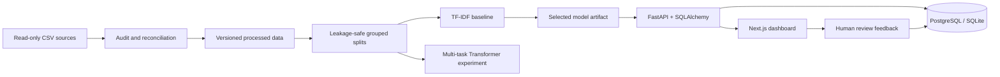

# BrandPulse-BD

Human-assisted customer-feedback intelligence for Bangla, Banglish, English, and code-mixed comments.

## At a glance

- Predicts complaint category, sentiment, and operational priority from one comment.
- Provides confidence scores and routes uncertain or High-priority predictions to human review.
- Includes a five-page Next.js dashboard, FastAPI service, PostgreSQL/SQLite persistence, reproducible NLP experiments, tests, and Docker configuration.
- Evaluated on 1,044 supplied comments from 8 companies without overwriting the source CSV files.


See the complete [project overview gallery](docs/project-overview/README.md) for the Comment Explorer, Live Prediction, and Review Queue screens.

> Local application: `http://localhost:3000` · API docs: `http://localhost:8000/docs` · No public deployment URL is currently available.

**Navigate:** [Results](#verified-results) · [Data quality](#data-summary-and-quality) · [Experiments](#modeling-experiments) · [Local setup](#local-setup-windows-powershell) · [Docker](#docker-compose) · [API](#api-examples) · [Limitations](#privacy-licensing-and-limitations) · [Repository map](#repository-map)

## System overview



## Verified results

The selected serving model is a character TF-IDF (3-5 grams) plus logistic regression baseline. Results use a fixed 172-record grouped test set after validation-only model selection.

| Target | Macro-F1 | Weighted-F1 | Accuracy |
|---|---:|---:|---:|
| Category | 0.2721 | 0.3740 | 0.3837 |
| Sentiment | 0.6373 | 0.6794 | 0.6977 |
| Priority | 0.5177 | 0.5701 | 0.6047 |

Priority weighted Cohen's kappa is `0.4544`; High→Low severe-error rate is `0.0833`. Category `Abuse/Harassment` recall is `0.0`, so this prototype is not suitable for unattended routing. Measured local CPU inference was `0.615 ms` median and `0.826 ms` P95 across 100 single-row runs; hardware will change these values.

## What is included

- Read-only discovery and reproducible audit of three supplied CSV files
- Traceable raw/labeled/cleaned text reconciliation, quality JSON, human review queue, figures, data card, and model card
- NFC-based minimal normalization that preserves punctuation, emoji, case, and negation
- Connected leakage groups across identical source URLs and normalized-identical comments
- Character TF-IDF baselines with validation-only class-weight/hyperparameter selection
- Shared multi-task character Transformer with three heads, class-weight ablation, and three seeds
- FastAPI, Pydantic, SQLAlchemy, PostgreSQL deployment, and SQLite local fallback
- Next.js, TypeScript, Tailwind, and Recharts dashboard with five required pages
- Confidence/High-priority human review and stored corrections without automatic retraining
- Dockerfiles, Docker Compose, GitHub Actions, unit tests, API integration tests, and smoke tests

## Data summary and quality

The supervised version contains 1,044 comments from 8 companies and 4 supplied platform strings. The source audit found:

- 10 malformed raw CSV records, excluded from supervised v1 and queued for review
- 2 raw-versus-labeled text conflicts, with both versions preserved
- 909 differences between labeled and supplied-preprocessed text
- 88 exact-duplicate-text rows and 91 formatting-normalized duplicate rows
- 914 rows sharing a source URL with another row
- only 8 total `Abuse/Harassment` labels, with 3 in train
- all 1,044 timestamps are relative-like, so parsed dates and time trends are disabled

See [data inventory](reports/data_inventory.md), [full audit](reports/data_audit.md), [data card](data_card.md), and [split report](reports/preprocessing_and_split.md).

## Modeling experiments

The baseline compared `C ∈ {0.5, 1, 2}` with unweighted and balanced logistic regression independently for each target. The TF-IDF vocabulary was fitted on train only.

A compact character-level Transformer was trained from scratch with one shared two-layer encoder and three classification heads. Validation selected inverse-square-root class weights. Its three-seed macro-F1 was:

| Target | Mean | Standard deviation |
|---|---:|---:|
| Category | 0.1558 | 0.0073 |
| Sentiment | 0.4232 | 0.0319 |
| Priority | 0.4498 | 0.0333 |

It underperformed the baseline. XLM-R and BanglaBERT were attempted, but their Hugging Face model-weight CDN returned no body after metadata/tokenizer requests; no scores are claimed for them. The intended pretrained multi-task implementation is retained for a future rerun.

See [baseline evaluation](reports/baseline_evaluation.md), [transformer evaluation](reports/transformer_evaluation.md), [comparative and subgroup evaluation](reports/model_evaluation.md), [manual error analysis](reports/error_analysis.md), and [model card](model_card.md).

## Local setup (Windows PowerShell)

Python 3.11 and Node.js 22 were used for verification.

```powershell
python -m pip install -r requirements-dev.txt
npm.cmd --prefix apps/web install
```

Run the reproducible pipeline:

```powershell
.\scripts\project.ps1 audit
.\scripts\project.ps1 preprocess
.\scripts\project.ps1 train-baseline
.\scripts\project.ps1 train-transformer
.\scripts\project.ps1 evaluate
.\scripts\project.ps1 test
```

Start the API and frontend in two terminals:

```powershell
.\scripts\project.ps1 api
.\scripts\project.ps1 web
```

The source CSV files stay in place and are never overwritten. Generated datasets are written only to `data/interim/` and `data/processed/`.

## Docker Compose

The local stack uses PostgreSQL, FastAPI, and Next.js:

```powershell
Copy-Item .env.example .env
# Replace POSTGRES_PASSWORD in .env before any shared deployment.
docker compose up --build
```

The repository includes the small selected baseline serving artifact, so prediction works after a fresh clone. The API image excludes original CSV files, while Compose mounts the local generated `data/` directory read-only for optional database seeding. A fresh clone therefore starts with an empty comment browser until you provide authorized source data and run the preprocessing pipeline.

## API examples

```bash
curl -X POST http://localhost:8000/predict \
  -H "Content-Type: application/json" \
  -d '{"text":"Payment korechi kintu internet active hoy nai","company":"Grameenphone","source_platform":"youtube"}'
```

The response includes real model probabilities, `needs_human_review`, explicit review reasons, and the model version. Required endpoints are exposed in OpenAPI at `/docs`.

## Privacy, licensing, and limitations

The collection method, platform licenses, redistribution rights, and reliable collection timestamps were not supplied. Original and processed comment datasets are therefore excluded from Git and Docker images. Only the selected baseline serving artifact and aggregate evaluation reports are included. Before publishing any dataset, independently verify its redistribution rights, platform terms, and PII exposure.

Comments and URLs may contain personal or account-related information. Publish only a small anonymized sample unless full redistribution is clearly allowed. Predictions are observational classifications, not causal findings or verified service outcomes.

Known model limitations include weak category performance, rare classes, multi-intent comments, annotation ambiguity, contrastive sentiment, source-specific shortcuts, and uncertain generalization to unseen companies. Human review is mandatory for predicted High priority and validation-threshold low confidence.

## Repository map

```text
apps/web/                 Next.js dashboard
services/api/             FastAPI service and Dockerfile
src/data/                 audit, reconciliation, preprocessing, split
src/features/             reusable text normalization
src/models/               baseline and multi-task Transformers
src/evaluation/           metrics and subgroup/error reporting
data/interim|processed/   generated, ignored artifacts
reports/                  generated evidence and figures
tests/                    unit, API integration, and smoke tests
scripts/project.ps1       verified Windows task runner
```

## Resume bullets (verified numbers only)

- Built BrandPulse-BD, a Bangla/Banglish customer-feedback platform that predicts category, sentiment, and priority across 1,044 comments from 8 companies and 4 supplied platform values using leakage-safe NLP pipelines, FastAPI, and a five-page Next.js dashboard.
- Delivered category/sentiment/priority macro-F1 of 0.272/0.637/0.518 with confidence-based human review, a Dockerized PostgreSQL-ready application, and measured local CPU P95 inference latency of 0.826 ms.
