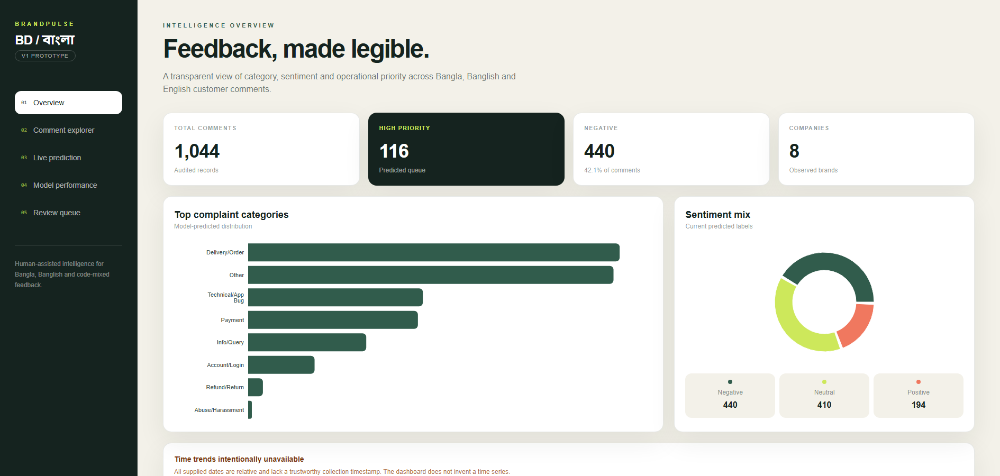
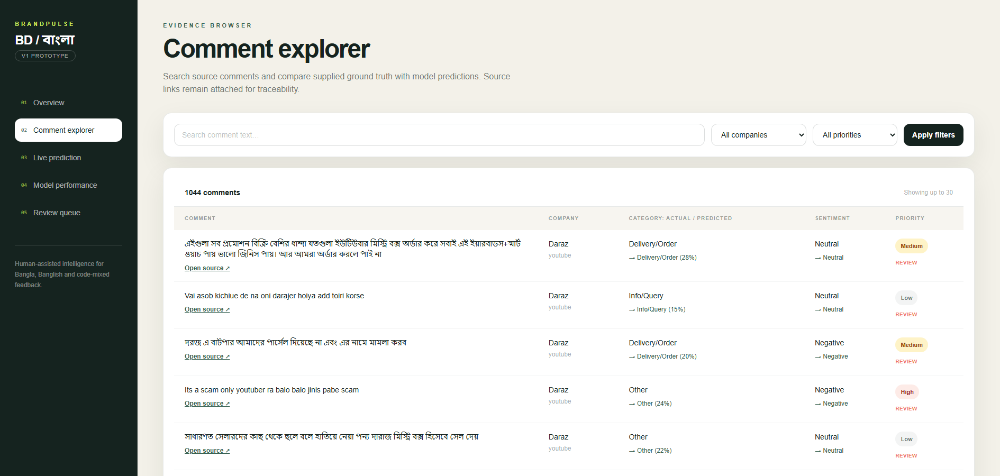
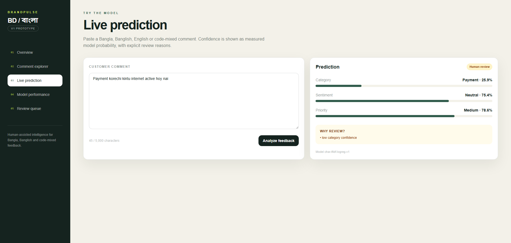
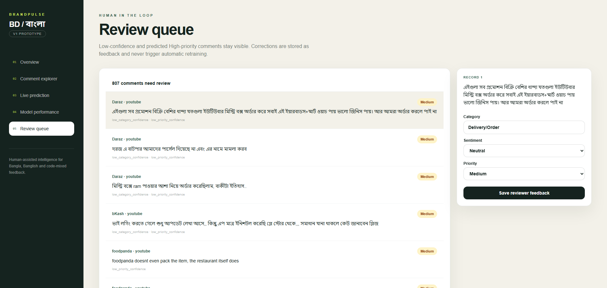

# BrandPulse-BD project overview

These screenshots were captured from the running local Docker Compose application at a 1890 × 900 viewport.

## Overview dashboard



## Comment explorer



## Live prediction



## Review queue



To refresh the screenshots while the application is running, execute:

```powershell
node scripts\capture_project_overview.mjs
```
